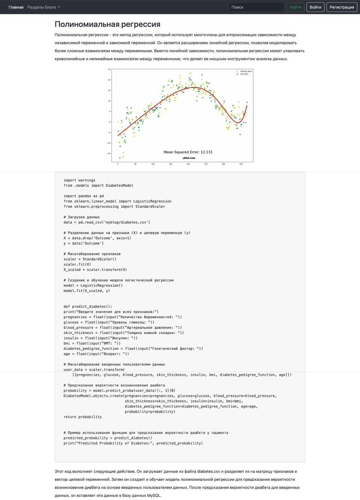
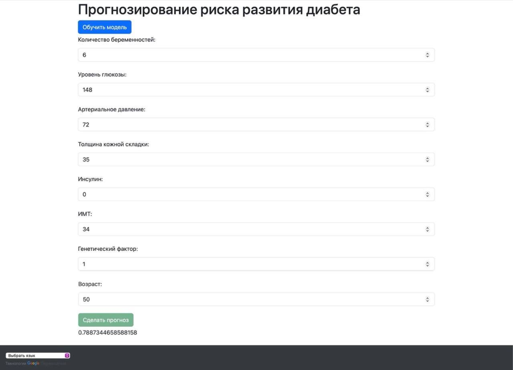

# GeekGenius Django Blog

GeekGenius is a Django-based blog project designed to provide a platform for users to create and share blog posts. This README provides instructions for setting up and running the project both locally and using Docker.

# '

## '

## '
## Prerequisites

Before you begin, ensure you have the following installed on your system:

- Python 3.x
- pip (Python package installer)
- Docker
- Docker Compose

## Environment Variables

The project uses environment variables for configuration. Set the following variables before running the project:

### Install Dependencies

Create a virtual environment and install the required Python packages:

```sh
python3 -m venv venv
source venv/bin/activate
pip install -r requirements.txt
```

### Apply Migrations

```sh
python manage.py migrate
```

### Run the Development Server

```sh
python manage.py runserver
```

You should now be able to access the blog at `http://127.0.0.1:8000`.

## Docker Setup

### 1. Build and Run the Docker Containers

Make sure you have Docker and Docker Compose installed. Then, run the following commands:

```sh
docker-compose up --build
```

This command will build the Docker images and start the containers as defined in the `docker-compose.yml` file.

### 2. Import Data into phpMyAdmin

To import initial data, follow these steps:

1. Open your web browser and navigate to `http://localhost:8080`.
2. Log in to phpMyAdmin using the credentials specified in your `docker-compose.yml`.
3. Select the appropriate database.
4. Navigate to the `Import` tab.
5. Choose the SQL file from the `[DB.sql](..%2FDB.sql)sql_data` directory and start the import.


## Additional Notes

- Make sure to configure your `blog/settings.py` file according to your environment (e.g., database settings, allowed hosts, etc.).
- Use the `.env` file to manage sensitive data and environment-specific configurations.
- For any issues or contributions, please refer to the project's issue tracker and pull request guidelines on GitHub.
